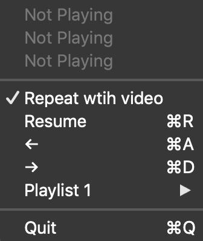
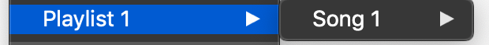
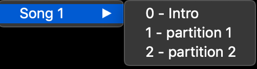

#  iTunes Music Partitioner

Partitions your music

In action:

Main UI:



Playlist Menu:



Song Menu:



File format:
The config file should be in `json`, change `all_songs_json` in `Constants.swift` to point to your file.

- It should have an array of playlists
- Each playlist contains an array of concerts (or tracks within a playlist)
- Each concert contains an array of partitions.

Example of the screenshot:
```json
[
  {
    "name": "Playlist 1",
    "concerts": [
      {
        "name": "Song 1",
        "songs": [
          {
            "name": "partition 1",
            "time": 10
          },
          {
            "name": "partition 2",
            "time": 100
          }
        ]
      }
    ]
  }
]
```
